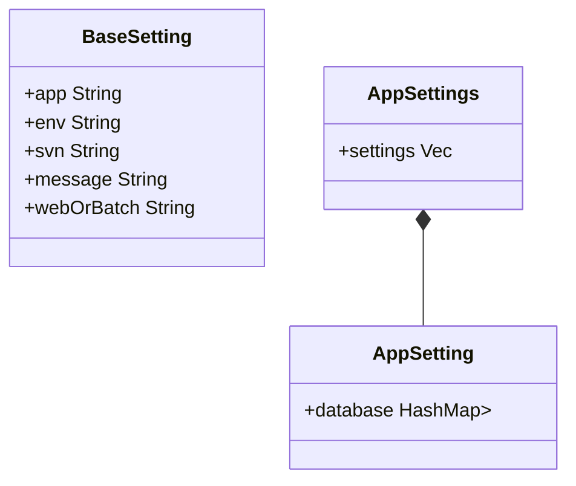

```json
[
    {
        "env": "dev",
        "appInfo": {
            "app": "pasnavi",
            "type": "web",
            "subApp": ""
        },
        "svn": "https://----",
        "message": "利用目的",
        "limit": "2023/03/31",
        "dbConnections": [
            {
                "schema": "pasnavi",
                "connectionSchema": "target_pasnavi",
            },
            {
                "schema": "enavi",
                "connectionSchema": "target_enavi",
            }
        ]
    },
    {
        "env": "dev",
        "appInfo": {
            "app": "enavi",
            "type": "batch",
            "subApp": "target_tok_batch"
        },
        "svn": "https://----",
        "message": "利用目的",
        "limit": "2023/03/31",
        "dbConnections": [
            {
                "schema": "enavi",
                "connectionSchema": "target_enavi",
            }
        ]
    }
]
```



```javascript
let (baseSetting, appSettings) = parseSettings(data);
let sheet = getSheet(baseSetting);

appSettings.forEach(
    setting => writeRow(sheet, baseSetting, setting)
);
```
