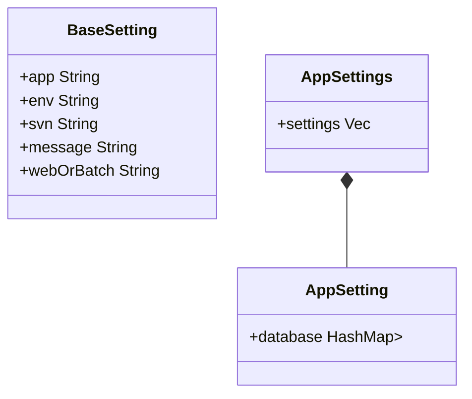

```json
{
    "env": "dev",
    "app": "pasnavi",
    "webOrBatch": "web",
    "svn": "https://----",
    "message": "利用目的",
    "appSettings": {
        "pasnavi": "target_pasnavi",
        "enavi": "target_enavi",
    },
    "enaviBatchSettings": {
        "batch": "target_tok_batch",
        "appSettings": {
            "enavi": "target_enavi",
        }
    }
}
```



```javascript
let (baseSetting, appSettings) = parseSettings(data);
let sheet = getSheet(baseSetting);

appSettings.forEach(
    setting => writeRow(sheet, baseSetting, setting)
);
```