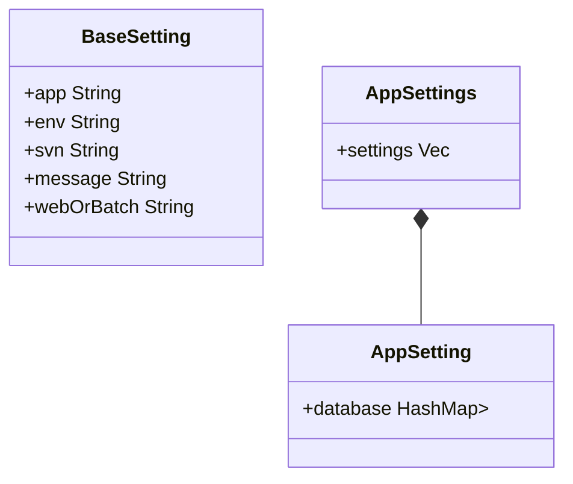

```json
{
    "env": "dev",
    "app": "pasnavi",
    "appType": "web",
    "svn": "https://----",
    "message": "利用目的",
    "appSettings": [
        {
            "schema": "pasnavi",
            "connectionSchema": "target_pasnavi",
        },
        {
            "schema": "enavi",
            "connectionSchema": "target_enavi",
        },
    ],
    "enaviBatchSettings": [
        {
            "batch": "target_tok_batch",
            "appSettings": [
                {
                    "schema": "enavi",
                    "connectionSchema": "target_enavi",
                },
            ]
        },
    ]
}
```



```javascript
let (baseSetting, appSettings) = parseSettings(data);
let sheet = getSheet(baseSetting);

appSettings.forEach(
    setting => writeRow(sheet, baseSetting, setting)
);
```