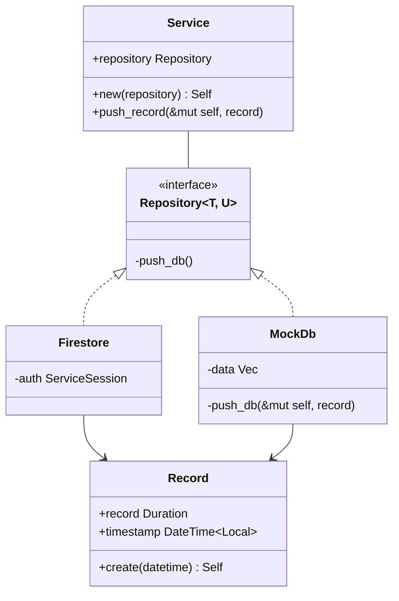

```mermaid
classDiagram
    class Repository~T, U~ {
        <<interface>>
        -push_db()
    }

    Service -- Repository
    class Service~Repository~{
        +repository Repository
        +new(repository) Self
        +push_record(&mut self, record)
    }

    Firestore --> Record
    Repository <|.. Firestore
    class Firestore {
        -auth ServiceSession
    }

    class Record {
        +record Duration
        +timestamp DateTime~Local~
        +create(datetime) Self
    }

    MockDb --> Record
    Repository <|.. MockDb
    class MockDb {
        -data Vec<Record>
        -push_db(&mut self, record)
    }
```