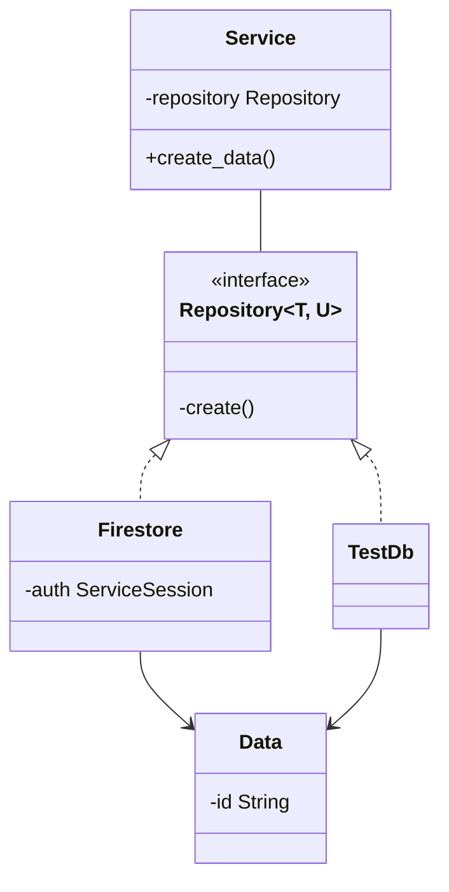

```mermaid
classDiagram
    class Repository~T, U~ {
        <<interface>>
        -create()
    }

    Service -- Repository
    class Service~Repository~{
        -repository Repository
        +create_data()
    }

    Firestore --> Data
    Repository <|.. Firestore
    class Firestore {
        -auth ServiceSession
    }

    class Data {
        -id String
    }

    TestDb --> Data
    Repository <|.. TestDb
    class TestDb {

    }
```