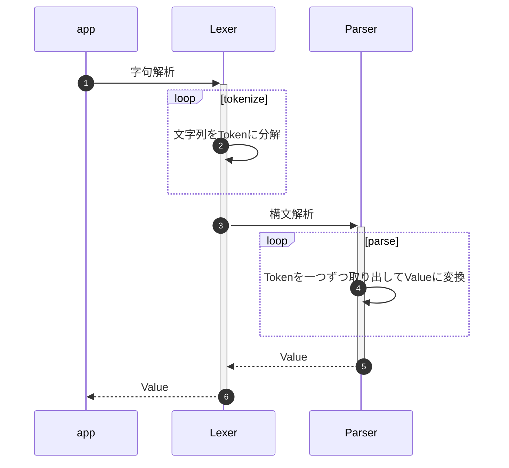

```mermaid
sequenceDiagram
    autonumber
    participant app
    participant Lexer
    participant Parser

    app ->>+ Lexer: 字句解析
    loop tokenize
        Lexer->>Lexer: 文字列をTokenに分解
    end
    Lexer ->>+ Parser: 構文解析
    loop parse
        Parser ->> Parser: Tokenを一つずつ取り出してValueに変換
    end
    Parser -->>- Lexer: Value
    Lexer -->>- app: Value

```